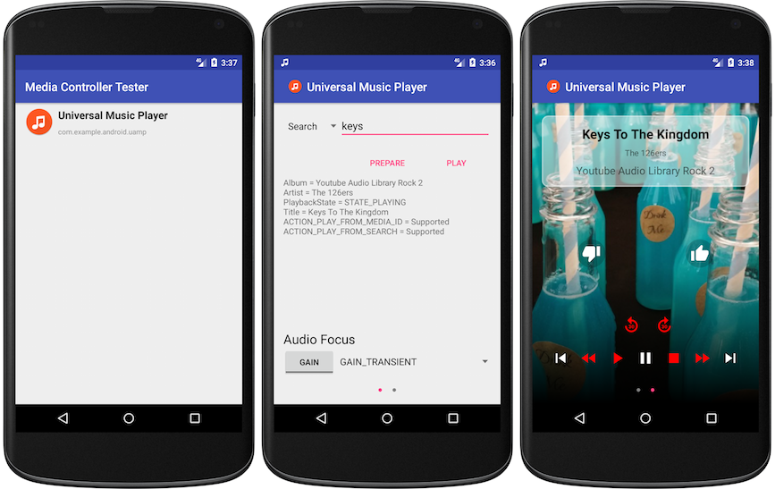

Media Controller Test
=====================
Cree un MediaController simple que se conecte a un MediaBrowserService para probar los controles multimedia entre aplicaciones. Esta herramienta se describe en la documentación de Android: Uso de la aplicación de prueba del controlador multimedia.

Esta aplicación funciona con el ejemplo Universal Android Music Player o con cualquier otra aplicación que implemente las API multimedia. https://github.com/googlesamples/android-UniversalMusicPlayer

Uso
=====

1. Seleccione una aplicación de la lista.
* Solo se mostrarán las aplicaciones que registren un servicio con la acción de filtro de intención "android.media.browse.MediaBrowserService".
2. Seleccione el tipo de acción que se realizará para iniciar el reproductor. Las opciones son:
* Buscar: Envía el texto como una búsqueda mediante _prepareFromSearch()_ o _playFromSearch()_.
* ID de medio: Envía el texto como ID de medio mediante _prepareFromMediaId()_ o _playFromMediaId()_.
* URI: Envía el texto como URI mediante _prepareFromUri()_ o _playFromUri()_.
* Sin entrada: Llama directamente a los métodos _prepare()_ o _play()_.
3. El texto debajo de los botones «PREPARE» y «PLAY» se actualiza según los cambios en el estado del reproductor multimedia mediante _onPlaybackStateChanged_ y _onMetadataChanged_, e incluye el estado actual del reproductor, informado mediante _PlaybackStateCompat.getState()_.
4. Desliza el dedo hacia la izquierda para ver los controles multimedia típicos con el arte multimedia como fondo, si lo hay.
5. Pulsa «atrás» para volver a la lista de aplicaciones multimedia.

Vía ADB
-------

También es posible iniciar la aplicación mediante ADB y el Gestor de actividades (AM).

Parámetro | Nombre adicional
----------|-----------
Nombre del paquete | `com.example.android.mediacontroller.PACKAGE_NAME`
Término de búsqueda | `com.example.android.mediacontroller.SEARCH`
ID del medio | `com.example.android.mediacontroller.MEDIA_ID`
URI | `com.example.android.mediacontroller.URI`

Para iniciar la aplicación y conectarse a UAMP:

`adb shell am start -n com.example.android.mediacontroller/.LaunchActivity --es com.example.android.mediacontroller.PACKAGE_NAME "com.example.android.uamp"`

Para realizar una búsqueda con el término "jazz?", se debe usar:

`adb shell am start -n com.example.android.mediacontroller/.MediaAppControllerActivity --es com.example.android.mediacontroller.SEARCH "jazz?"`

Verificación
============

Enfoque de audio
-----------

Esta aplicación permite probar cómo responden las aplicaciones multimedia a los cambios de enfoque de audio.

La aplicación permite solicitar y abandonar los siguientes tipos de enfoque de audio:
* AUDIOFOCUS_GAIN
* AUDIOFOCUS_GAIN_TRANSIENT
* AUDIOFOCUS_GAIN_TRANSIENT_MAY_DUCK

Para obtener más información sobre el enfoque de audio, consulta
[Administración del enfoque de audio](https://developer.android.com/guide/topics/media-apps/audio-focus.html).

Acciones compatibles
-----------------

Esta herramienta muestra las acciones compatibles, según lo informado por MediaSession en la llamada a
[MediaSessionCompat.setPlaybackState()](https://developer.android.com/reference/android/support/v4/media/session/MediaSessionCompat.html#setPlaybackState(android.support.v4.media.session.PlaybackStateCompat))
como una lista de acciones de preparación y reproducción en la pantalla principal. Para las acciones no declaradas como compatibles, también colorea los botones en rojo en la pantalla del controlador.

Consulta las capturas de pantalla a continuación para ver ejemplos.

Capturas de pantalla
===========

Licencia
=======

Copyright 2017 Google Inc. Todos los derechos reservados.

Licencia Apache, versión 2.0 (la "Licencia");
no puede utilizar este archivo salvo que cumpla con la Licencia.
Puede obtener una copia de la Licencia en

http://www.apache.org/licenses/LICENSE-2.0

Salvo que la legislación aplicable lo exija o se acuerde por escrito, el software distribuido bajo la Licencia se distribuye "TAL CUAL",
SIN GARANTÍAS NI CONDICIONES DE NINGÚN TIPO, ni expresas ni implícitas.
Consulte la Licencia para conocer el texto específico que rige los permisos y las limitaciones de la misma.
